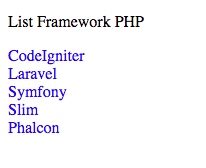

CodeIgniter merupakan framework PHP yang ringan dan simple. Tapi codeigniter tidak memiliki template engine seperti Laravel yang memiliki Blade. Tapi kita dapat menggunakan template engine dari pihak ketiga salah satunya [TWIG](https://twig.symfony.com/).

TWIG merupakan template engine PHP yang fleksibel, cepat dan aman. TWIG ini template engine yang digunakan olah framework PHP lainnya yaitu [Symfony](https://symfony.com/). Tapi kita tetap bisa menggunakan template ini pada CodeIgniter. Saat  artikel ini dibuat versinya adalah `2.4.6`.

TWIG ini seperti Blade pada Laravel membuat source code pada view kita menjadi clean, tanpa ada syntax php yang digunakan pada file view. Jika pada blade kita masih bisa menggunakan syntax plain php, maka pada twig itu tidak bisa dilakukan. Semua logic rumit dilakukan di controller, di view hanya melakukan logic sederhana seperti if dan for.

### Cara Install TWIG

Untuk menginstall TWIG terdapat 2 cara yaitu menggunakan composer dan tanpa composer. Saya akan jelaskan keduanya.

#### Install twig dengan composer

Pastikan kalian sudah menginstall composer pada komputer kalian.

Buka aplikasi CLI kalian seperti terminal atau CMD lalu masuk ke directory project kalian dan lakukan command

`composer require kenjis/codeigniter-ss-twig`

maka composer akan membuat folder baru bernama vendor di root project kalian.  
Saya menggunakan package dari [`https://github.com/kenjis/codeigniter-ss-twig`](https://github.com/kenjis/codeigniter-ss-twig) yang khusus secara otomatis menginstall package twig ke dalam folder vendor.  
Jika sudah selesai mendownload, jalankan command

`php vendor/kenjis/codeigniter-ss-twig/install.php`

Perintah diatas untuk meng-copy file library bernama `Twig.php` ke folder `application/libraries`.

Buka file `application/config/config.php` dan ubah bagian `$config['composer_autoload'] = FALSE;` menjadi `$config['composer_autoload'] = './vendor/autoload.php';` agar dapat menggunakan package yang telah di install menggunakan composer.

#### install twig tanpa composer

Download library TWIG versi 1.x di [https://github.com/twigphp/Twig/releases](https://github.com/twigphp/Twig/releases)

Kemudian download pula library CodeIgniter untuk menggunakan TWIG di [https://github.com/kenjis/codeigniter-ss-twig](https://github.com/kenjis/codeigniter-ss-twig). Ekstrak dan copy file `codeigniter-ss-twig/libraries/Twig.php` ke `application/libraries`

Buka file `application/libraries/Twig.php` dan hapus comment pada bagian dibawah ini

```php
/*
require_once APPPATH . 'third_party/Twig-1.xx.x/lib/Twig/Autoloader.php';
Twig_Autoloader::register();
*/
```

### Menggunakan Template TWIG

Buka file `application/config/autoload.php` dan ubah pada bagian ini `$autoload['libraries'] = array('twig');`

Buat sebuah controller baru dan beri nama `Main.php`

```php
<?php
defined('BASEPATH') OR exit('No direct script access allowed');

class Main extends CI_Controller {

  public function index() {
    $data = [
     'title' => 'CodeIgniter TWIG',
     'framework' => ['CodeIgniter', 'Laravel', 'Symfony', 'Slim', 'Phalcon']
   ];

    // Menampilkan view dengan TWIG
    $this->twig->display('index', $data);
  }

}

/* End of file Main.php */
/* Location: ./application/controllers/Main.php */
```

Selanjutnya buat sebuah master layout pada view dan beri nama `master.twig`

```html
<!DOCTYPE html>
<html>
<head>
  <title>{{ title }}</title>
  <style>
    li {
      list-style-type: none;
      color: blue;
    }
  </style>
</head>
<body>
  
</body>
</html>
```

Lalu buat lagi sebuah file pada view dan beri nama `index.twig`

```twig



  <p>List Framework PHP</p>
  {# Looping Array #}
  
    <li>{{ item }}</li>
  

```

Jika tidak ada error maka akan tampil seperti ini



`{{ .. }}` Tanda ini digunakan untuk pencetakan variable pada file twig seperti pada Blade jika kalian pernah menggunakan Laravel, tapi tanpa menggunakan tanda `$`.

`` Digunakan untuk menggunakan fungsi logic seperti if dan for menggunakan

`{# .. #}` Digunakan meng-commenct syntax agar tidak di eksekusi

Statement `blocks` pada `file master.twig` digunakan untuk menampilkan content yang isinya nanti akan berubah ubah.

Sedangkan statement `blocks` pada file `index.twig` merupakan content yang akan ditampilkan pada file `master.twig`. Statement extends digunakan untuk memanggil file `master.twig` agar nantinya content kita yang dibuat dapat tampil pada block di file `master.twig`

Untuk looping menggunakan fungsi for kemudian diikuti nama alias dari array yang kita buat kemudian variable array. Kebalikan dari foreach  yang array dulu baru nama alias.

Kalian dapat membaca fungsi lainnya diwebsite resminya [https://twig.symfony.com/doc/2.x/](https://twig.symfony.com/doc/2.x/)

Bagi kalian pengguna Sublime Text, kalian dapat menggunakan package TWIG untuk autocomplete dari TWIG yaitu [https://github.com/Anomareh/PHP-Twig.tmbundle](https://github.com/Anomareh/PHP-Twig.tmbundle)

Saat ini saya juga masih belajar menggunakan fungsi-fungsi lain dari TWIG pada CodeIgniter dan sedang menerapkan TWIG ini pada HMVC di CodeIgniter.

Kedepannya saya akan membagikan Integrasi TWIG dan HMVC di CodeIgniter.

Semoga bermanfaat.