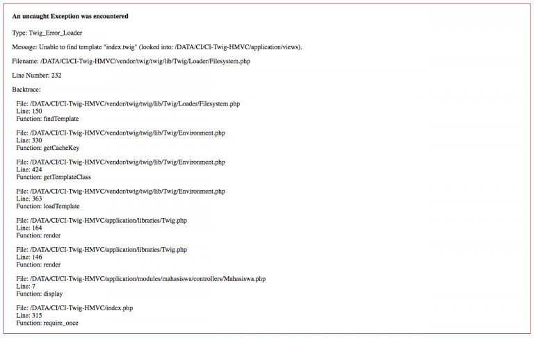

Pada artikel sebelumnya saya pernah memberikan sedikit tutorial tentang [Cara Setup HMVC di CodeIgniter](/setup-hmvc-di-codeigniter-3) dan [Instalasi Template TWIG di CodeIgniter](/instalasi-template-twig-di-codeigniter). Kali ini saya akan memberikan sedikit tutorial tentang konfigurasi template twig dan hmvc di codeigniter. Karena saya terbiasa menggunakan HMVC dan juga sedang mencoba TWIG.

Jika kalian telah menginstall HMVC dan TWIG, saat kalian mengakses controller kalian pasti akan terjadi error seperti ini



Ini dikarenakan TWIG itu tidak menemukan file yg dimaksud.

Jika tanpa menggunakan HMVC lokasi file viewnya adalah ada pada `application/views`. Semetara saat menggunakan HMVC adalah `application/modules/nama_modules/views`

Sedangkan nama module ini ada dinamis sesuai dengan module yg kita buat.

##### Konfigurasi TWIG dan HMVC

Untuk mengatasinya adalah buka file `application/libraries/Twig.php`

Pada function construct ubah menjadi seperti berikut

```php
// View Path Using HMVC
$this->ci =& get_instance();
$currentClass = $this->ci->router->fetch_class();

// default config
$this->config = [
  'paths' => [APPPATH . 'modules/' . $currentClass .'/views', VIEWPATH], //default VIEWPATH
  'cache' => APPPATH . 'cache/twig',
];
```

Diatas terdapat fungsi untuk mendapatkan nama class yg saat ini digunakan, kemudian menambahkan lokasi view baru ke dalam variabel `config`.

Sehingga TWIG akan mencari file yang dimaksud pada kedua folder tersebut.

Selesai sudah untuk konfigurasi HMVC dan TWIG di CodeIgniter.

Kalian dapat mendownload Base Source CodeIgniter menggunakan HMVC dan TWIG di [https://github.com/andriyandriyan/codeigniter-hmvc-twig](https://github.com/andriyandriyan/codeigniter-hmvc-twig)

Demikianlah dan semoga bermanfaat.