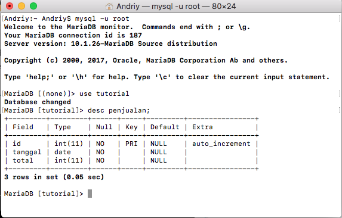
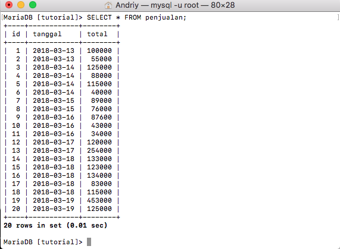
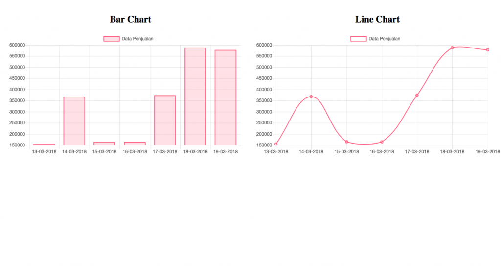

Saat kita membuat sebuah aplikasi web, dihalaman dashboard biasanya ditampilkan grafik atau chart yang fungsinya untuk menganalisa laporan secara global. Kali ini saya akan memberikan sedikit tutorial bagaimana membuat grafik di PHP-MySQL menggunakan chartjs. [Chartjs ](http://www.chartjs.org/)merupakan satu salah library yang open source. Library ini memanfaatkan element canvas dalam membuat grafik pada halaman web. Terdapat beberapa type grafik yang dapat dibuat oleh chartjs seperti line chart, bar chart, radar chart, pie chart dan donut chart. Tapi kali ini saya hanya akan membuat line chart dan bar chart dari data penjualan perhari selama 7 hari terakhir.

### Membuat Tabel

Buat sebuah tabel dengan nama penjualan dengan isi field seperti berikut ini :



### Mengisi Tabel Penjualan

Selanjutnya adalah mengisi tabel yang telah kira buat.

Silahkan copy dan jalankan query berikut :
```sql
    INSERT INTO `penjualan` (`id`, `tanggal`, `total`)
	VALUES
	(NULL, '2018-03-13', '100000'),
	(NULL, '2018-03-13', '55000'),
	(NULL, '2018-03-14', '125000'),
	(NULL, '2018-03-14', '88000'),
	(NULL, '2018-03-14', '115000'),
	(NULL, '2018-03-14', '40000'),
	(NULL, '2018-03-15', '89000'),
	(NULL, '2018-03-15', '76000'),
	(NULL, '2018-03-16', '87600'),
	(NULL, '2018-03-16', '43000'),
	(NULL, '2018-03-16', '34000'),
	(NULL, '2018-03-17', '120000'),
	(NULL, '2018-03-17', '254000'),
	(NULL, '2018-03-18', '133000'),
	(NULL, '2018-03-18', '123000'),
	(NULL, '2018-03-18', '134000'),
	(NULL, '2018-03-18', '83000'),
	(NULL, '2018-03-18', '115000'),
	(NULL, '2018-03-19', '453000'),
	(NULL, '2018-03-19', '125000');
```

Setelah menjalankan query diatas cek isi data pada tabel penjualan



### Instalasi Chartjs

Download library file `chart.bundle.min.js` pada [https://github.com/chartjs/Chart.js/releases/latest](https://github.com/chartjs/Chart.js/releases/latest) lalu copy kan file tersebut ke folder project kalian.

### Membuat Grafik

Lalu buat sebuah file `index.php` isinya seperti berikut ini :

```php
    <?php
    $connect = mysqli_connect('localhost', 'root', '', 'tutorial');
    $data_penjualan = mysqli_query($connect, "SELECT tanggal, SUM(total) AS total FROM penjualan GROUP BY tanggal");

    $data_tanggal = array();
    $data_total = array();

    while ($data = mysqli_fetch_array($data_penjualan)) {
      $data_tanggal[] = date('d-m-Y', strtotime($data['tanggal'])); // Memasukan tanggal ke dalam array
      $data_total[] = $data['total']; // Memasukan total ke dalam array
    }
    ?>

    <!DOCTYPE html>
    <html>
    <head>
      <title>Membuat Grafik Di PHP dan MySQL menggunakan Chartjs</title>
      <style>
        .container {
          width: 100%;
          margin: 15px 10px;
        }

        .chart {
          width: 50%;
          float: left;
          text-align: center;
        }
      </style>
      <script type="text/javascript" src="Chart.bundle.min.js"></script>
    </head>
    <body>
      <div class="container">
        <div class="chart">
          <h2>Bar Chart</h2>
          <canvas id="bar-chart"></canvas>
        </div>
        <div class="chart">
          <h2>Line Chart</h2>
          <canvas id="line-chart"></canvas>
        </div>
      </div>

      <script>
        var barchart = document.getElementById('bar-chart');
        var chart = new Chart(barchart, {
          type: 'bar',
          data: {
            labels: <?php echo json_encode($data_tanggal) ?>, // Merubah data tanggal menjadi format JSON
            datasets: [{
              label: 'Data Penjualan',
              data: <?php echo json_encode($data_total) ?>,
              backgroundColor: [
                'rgba(255, 99, 132, 0.2)',
                'rgba(255, 99, 132, 0.2)',
                'rgba(255, 99, 132, 0.2)',
                'rgba(255, 99, 132, 0.2)',
                'rgba(255, 99, 132, 0.2)',
                'rgba(255, 99, 132, 0.2)',
                'rgba(255, 99, 132, 0.2)'
              ],
              borderColor: [
                'rgba(255,99,132,1)',
                'rgba(255,99,132,1)',
                'rgba(255,99,132,1)',
                'rgba(255,99,132,1)',
                'rgba(255,99,132,1)',
                'rgba(255,99,132,1)',
                'rgba(255,99,132,1)'
              ],
              borderWidth: 2
            }]
          }
        });

        var linechart = document.getElementById('line-chart');
        var chart = new Chart(linechart, {
          type: 'line',
          data: {
            labels: <?php echo json_encode($data_tanggal) ?>, // Merubah data tanggal menjadi format JSON
            datasets: [{
              label: 'Data Penjualan',
              data: <?php echo json_encode($data_total) ?>,
              borderColor: 'rgba(255,99,132,1)',
              backgroundColor: 'transparent',
              borderWidth: 2
            }]
          }
        });
      </script>
    </body>
    </html>
```
### Penjelasan Code

*   *   Menjumlahkan total penjualan berdasarkan tanggal yang sama menggunakan query sql `SUM(total)` dan `GROUP BY`
    *   Membuat 2 variabel array yang nantinya diisi dengan data tanggal dan total penjualan yaitu variabel `$data_tanggal` dan `$data_total`
    *   Lalu looping data penjualan kemudian mengisi data pada variabel array yang telah dibuat.
    *   `date('d-m-Y', strtotime($data['tanggal']))` befungsi agar format tanggal menjadi 17-03-2018 karena sebelumnya formatnya adalah 2018-03-17
    *   `<?php echo json_encode($data_tanggal) ?>` dan `<?php echo json_encode($data_total) ?>` digunakan untuk merubah format array php menjadi format JSON. Karena charjs ini hanya menerima label dan data berupa format JSON.

Jika tidak ada error maka pada halaman web akan tampil seperti berikut.



Kalian dapat memodifikasi warna dari chart sesuai dengan keinginan kalian dengan membaca dokumentasi di [http://www.chartjs.org/docs/latest/](http://www.chartjs.org/docs/latest/).

Demikianlah tutorial bagaimana membuat grafik di PHP-MySQL menggunakan chartjs.

Semoga bermanfaat.