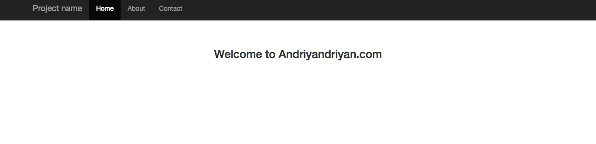
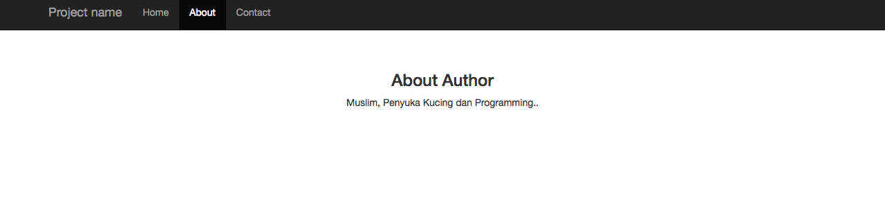
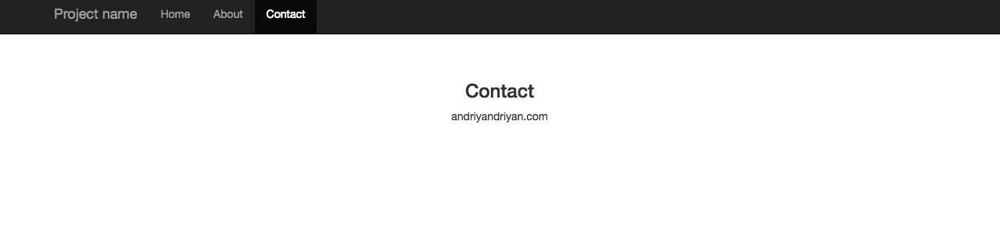

## Membuat Template View CodeIgniter

Kali ini saya akan membagikan tutorial bagaimana membuat template view pada CodeIgniter. Dengan menggunakan template view, maka kita tidak perlu lagi meng-include file header atau footer pada halaman view yang akan dibuat.

#### Langkah 1.

Pertama adalah membuat sebuah file baru pada folder view dan beri nama `master.php` yang nanti isinya berupa master template dari view.  
Isi kode `master.php`

```html
<!DOCTYPE html>
<html lang="en">
<head>
    <meta charset="utf-8">
    <meta http-equiv="X-UA-Compatible" content="IE=edge">
    <meta name="viewport" content="width=device-width, initial-scale=1">
    <!-- The above 3 meta tags *must* come first in the head; any other head content must come *after* these tags -->
    <meta name="description" content="">
    <meta name="author" content="">

    <title>Master Template CodeIgniter</title>

    <!-- Bootstrap core CSS -->
    <link rel="stylesheet" href="https://maxcdn.bootstrapcdn.com/bootstrap/3.3.7/css/bootstrap.min.css" integrity="sha384-BVYiiSIFeK1dGmJRAkycuHAHRg32OmUcww7on3RYdg4Va+PmSTsz/K68vbdEjh4u" crossorigin="anonymous">

    <!-- Custom styles for this template -->
    <link href="starter-template.css" rel="stylesheet">

    <!-- Just for debugging purposes. Don't actually copy these 2 lines! -->
    <!--[if lt IE 9]><script src="../../assets/js/ie8-responsive-file-warning.js"></script><![endif]-->
    <script src="../../assets/js/ie-emulation-modes-warning.js"></script>

    <!-- HTML5 shim and Respond.js for IE8 support of HTML5 elements and media queries -->
    <!--[if lt IE 9]>
      <script src="https://oss.maxcdn.com/html5shiv/3.7.3/html5shiv.min.js"></script>
      <script src="https://oss.maxcdn.com/respond/1.4.2/respond.min.js"></script>
      <![endif]-->
      <style>
      	body {
            padding-top: 50px;
        }
        .master-template {
            padding: 40px 15px;
            text-align: center;
        }
      </style>
  </head>

  <body>

  	<nav class="navbar navbar-inverse navbar-fixed-top">
  		<div class="container">
  			<div class="navbar-header">
  				<button type="button" class="navbar-toggle collapsed" data-toggle="collapse" data-target="#navbar" aria-expanded="false" aria-controls="navbar">
  					<span class="sr-only">Toggle navigation</span>
  					<span class="icon-bar"></span>
  					<span class="icon-bar"></span>
  					<span class="icon-bar"></span>
  				</button>
  				<a class="navbar-brand" href="<?= site_url('main') ?>">Project name</a>
  			</div>
  			<div id="navbar" class="collapse navbar-collapse">
  				<ul class="nav navbar-nav">
  					<li><a href="<?= site_url('main') ?>">Home</a></li>
  					<li><a href="<?= site_url('main/about') ?>">About</a></li>
  					<li><a href="<?= site_url('main/contact') ?>">Contact</a></li>
  				</ul>
  			</div><!--/.nav-collapse -->
  		</div>
  	</nav>

  	<div class="container">

  		<div class="master-template">
  			<?= $_content; ?>
  		</div>

  	</div><!-- /.container -->
</body>
</html>
```

Pada kode diatas line ke **65** ada variable `$_content`, ini adalah variable yang berisi content dari page yang isinya akan berubah sesuai dengan page yang kita buka. Saya menggunakan bootstrap untuk membuat template diatas.

#### Langkah 2.

Selanjutnya membuat sebuah library yg befungsi untuk mengatur template kita.

Pada folder `libraries` buat sebuah file baru bernama `Template.php`

```php
<?php
defined('BASEPATH') OR exit('No direct script access allowed');

class Template {
    protected $ci;

    public function __construct() {
        $this->ci =& get_instance();
    }

    public function display($view, $data = null) {
        $data['_content'] = $this->ci->load->view($view, $data, TRUE);
        $this->ci->load->view('master', $data, FALSE);
    }

}

/* End of file Template.php */
/* Location: ./application/libraries/Template.php */
```

Pada file diatas terdapat function bernama display, fungsi inilah yang akan kita gunakan mengatur template kita, pada fungsi tersebut terdapat 2 buah parameter, yaitu `$view` dan `$data`.

`$view` adalah lokasi file view kita sedangkan `$data` adalah variabel yang akan dikirim ke halaman view

#### Langkah 3

Buat sebuah file controller baru dari beri nama `Main.php`

```php
<?php
defined('BASEPATH') OR exit('No direct script access allowed');

class Main extends CI_Controller {

  public function __construct() {
    parent::__construct();
    $this->load->library('template');
  }

  public function index() {
    $this->template->display('home');
  }

  public function about() {
    $this->template->display('about');
  }

  public function contact() {
    $this->template->display('contact');
  }

}

/* End of file Main.php */
/* Location: ./application/controllers/Main.php */
```

Lalu buat lagi 3 buah file view

`home.php`

```html
<div class="text-center">
  <h3>Welcome to Andriyandriyan.com</h3>
</div>
```

`about.php`

```html
<div class="text-center">
  <h3>About Author</h3>
  <p>Muslim, Penyuka Kucing dan Programming..</p>
</div>
```

`contact.php`

```html
<div class="text-center">
  <h3>Contact</h3>
  <p>andriyandriyan.com</p>
</div>
```

Setelah semua selesai maka hasilnya adalah seperti berikut





Jika ada yang bingung silahkan bertanya pada kolom komentar. Sekian dan Semoga Bermanfaat.