Firebase merupakan platform database buatan Google yang berbasis NoSQL Database. Salah satu kelebihan Firebase ini adalah **Realtime Database**. Setiap perubahan data yang dilakukan maka data pada client pun akan langsung berubah. Kali ini kita akan mencoba membuat aplikasi Ionic menggunakan Firebase dan package AngularFire.

Sebelum memulai pastikan sudah menginstall Ionic CLI pada computer kalian.

### Membuat Aplikasi Ionic

Pertama adalah membuat project ionic. Buka Terminal tau Command Prompt dan arahkan pada directory yang diinginkan dan jalankan command berikut :

`ionic start firebase-app blank`

*   `ionic start` adalah command untuk membuat project ionic
*   `firebase-app` adalah nama aplikasi yang akan kita buat
*   `blank` adalah template ionic yang akan digunakan

Selanjutnya kita membutuhkan package AngularFire dan Firebase agar kita bisa menggunakan Firebase Database.

Masuk ke directory folder project yang dibuat dan jalankan command berikut:

`npm install angularfire2 firebase --save`

Command diatas berfungsi untuk meng-install package angularfire dan firebase

### Membuat Project Firebase Pada Firebase Console

Pertama kita harus membuat sebuah project pada Firebase Console. Silahkan buka [link ini](http://console.firebase.google.com).

Pada halaman console pilih add project

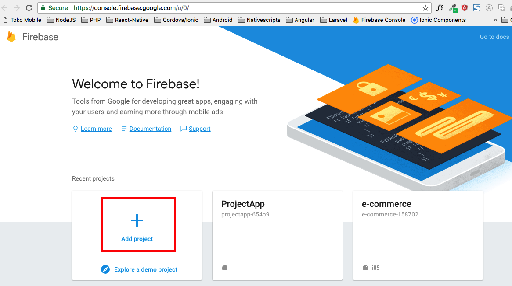

Setelah itu isi form pada pop up yang tampil, isikan nama project, untuk pilihan negara hanya optional saja. Kemudian klik create project.

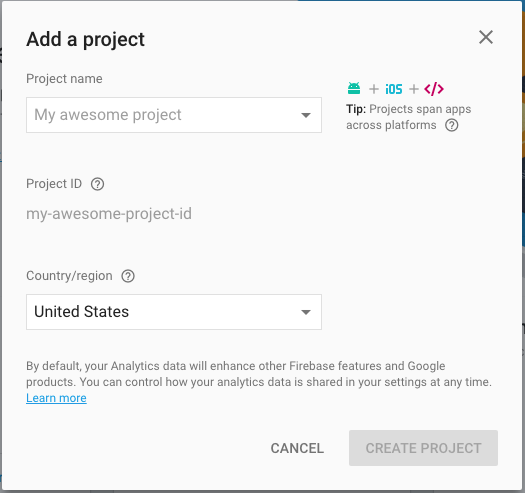

Setelah selesai dibuat masuk ke dalam dashboard project, dibagian kanan klik "Add Another App" dan pilih "Add firebase to your web app"

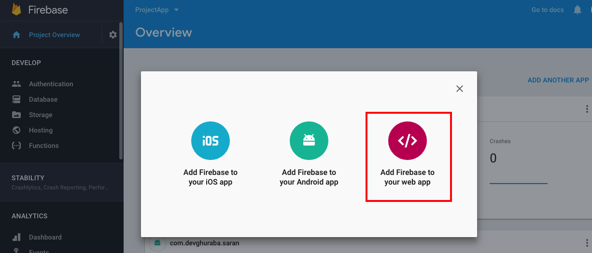

Copy script yang saya tandai

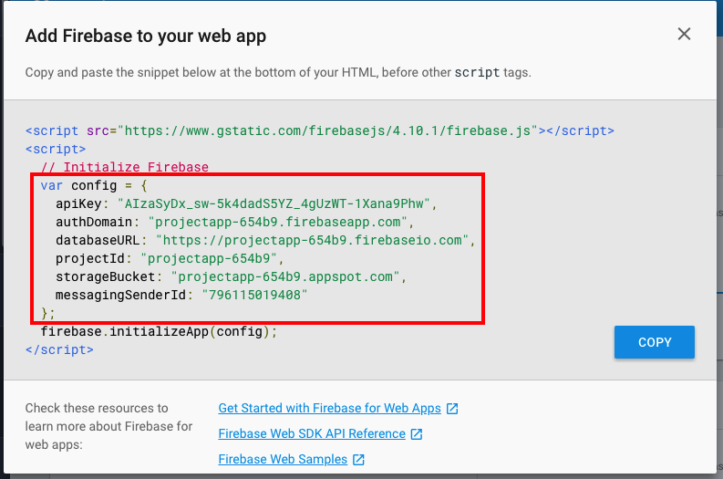

### Coding Aplikasi Ionic

Buka file `src/app/app.module.ts` kemudian paste script yang telah disalin, dan import module angularfire

```typescript
import { BrowserModule } from '@angular/platform-browser';
import { ErrorHandler, NgModule } from '@angular/core';
import { IonicApp, IonicErrorHandler, IonicModule } from 'ionic-angular';
import { SplashScreen } from '@ionic-native/splash-screen';
import { StatusBar } from '@ionic-native/status-bar';

import { MyApp } from './app.component';
import { HomePage } from '../pages/home/home';

// Angular Fire Module
import { AngularFireModule } from 'angularfire2';
import { AngularFireDatabaseModule } from 'angularfire2/database';

// AngularFire Settings
export const firebaseConfig = {
    apiKey: "xxxxxx",
    authDomain: "xxx.firebaseapp.com",
    databaseURL: "https://xxx.firebaseio.com",
    projectId: "xx-xxx",
    storageBucket: "xxxx.appspot.com",
    messagingSenderId: "xxxxxxxx"
};
```

Lalu import module angularfire pada NgModule

```typescript
@NgModule({
    declarations: [
        MyApp,
        HomePage
    ],
    imports: [
        BrowserModule,
        IonicModule.forRoot(MyApp),
        AngularFireModule.initializeApp(firebaseConfig), // Tambahkan ini
        AngularFireDatabaseModule  // Tambahkan ini
    ],
    bootstrap: [IonicApp],
    entryComponents: [
        MyApp,
        HomePage
    ],
    providers: [
        StatusBar,
        SplashScreen,
        {provide: ErrorHandler, useClass: IonicErrorHandler}
    ]
})
```

### Membuat CRUD Pada Ionic

Sekarang saatnya kita membuat CRUD menggunakan Firebase Database.

Pertama buka file `src/pages/home/home.ts` kemudian import module AngularFire dan list observable

```typescript
import { AngularFireDatabase, AngularFireList } from 'angularfire2/database';
import { Observable } from 'rxjs/Observable';
```

Lalu buat 2 buah variable didalam class Home sebelum constructor.

```typescript
frameworksRef: AngularFireList<any>;
frameworks: Observable<any[]>;
```

Setelah itu inject AngularFire di constructor dan inisialisi nilai dari variable yang telah dibuat

```typescript
constructor(public navCtrl: NavController, private afDatabase: AngularFireDatabase) {
    this.frameworksRef = this.afDatabase.list('/frameworks');
    this.frameworks = this.frameworksRef.snapshotChanges().map(changes => {
         return changes.map(c => ({ key: c.payload.key, ...c.payload.val() }));
    });
}
```

Code lengkapnya adalah seperti berikut ini:

```typescript
import { Component } from '@angular/core';
import { NavController } from 'ionic-angular';

import { AngularFireDatabase, AngularFireList } from 'angularfire2/database';
import { Observable } from 'rxjs/Observable';

@Component({
    selector: 'page-home',
    templateUrl: 'home.html'
})
export class HomePage {
    frameworksRef: AngularFireList<any>;
    frameworks: Observable<any[]>;

    constructor(public navCtrl: NavController, private afDatabase: AngularFireDatabase) {
        this.frameworksRef = this.afDatabase.list('/frameworks');
        this.frameworks = this.frameworksRef.snapshotChanges().map(changes => {
            return changes.map(c => ({ key: c.payload.key, ...c.payload.val() }));
        });
    }

}

```

Selanjutnya adalah membuat list dari data di dalam file `home.html`

Ubah isi file home.html seperti berikut

```html
<ion-header>
    <ion-navbar>
        <ion-title>
            Framework List
        </ion-title>
    </ion-navbar>
</ion-header>

<ion-content>
    <ion-item *ngFor="let framework of frameworks | async">{{ framework.name }}</ion-item>
</ion-content>
```

Kembali ke terminal atau cmd, jalan perintah `ionic serve` agar project ionic dapat berjalan di browser.

Ternyata saat dibrowser terjadi error berikut.

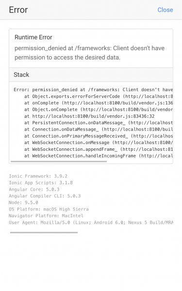

Error diatas terjadi karena pada project firebase yang kita buat membutuhkan autentikasi, dan kita tidak memasukan autentikasi tersebut.

Cara mengatasinya adalah dengan kembali pada dashboard project firebase kemudian pada sidemenu, pilih database kemudian pilih realtime database.

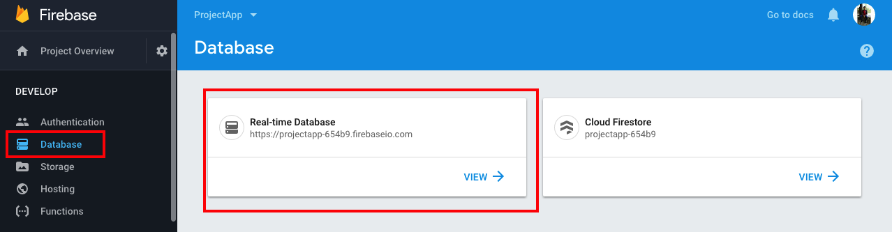

Setelah itu klik tab rules dan ubah isi rules seperti berikut, kemudian klik publish

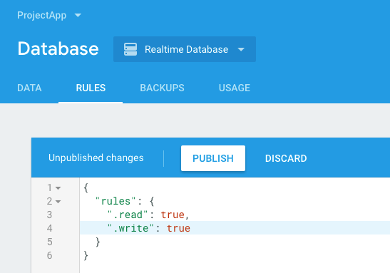

Jika sudah, refresh project ionic dan errornya hilang dan tampilannya seperti berikut


#### Membuat fungsi create

Selanjutnya adalah membuat fungsi untuk create data.

Kita akan menggunaan prompt sederhana dari ionic untuk memasukkan data.

Import [`AlertController`](https://ionicframework.com/docs/components/#alert-prompt) pada file `home.ts`, kemudian inject dan inisiliasi pada constructor.

`import { NavController, AlertController } from 'ionic-angular';`

```typescript
constructor(public navCtrl: NavController, private afDatabase: AngularFireDatabase, private alertCtrl: AlertController) {
    this.frameworksRef = this.afDatabase.list('/frameworks');
    this.frameworks = this.frameworksRef.snapshotChanges().map(changes => {
        return changes.map(c => ({ key: c.payload.key, ...c.payload.val() }));
    });
}
```

Masih pada file `home.ts` tambahkan fungsi dibawah ini untuk menampilkan prompt input.

```typescript
add() {
    let prompt = this.alertCtrl.create({
        title: 'Tambahkan Framework',
        message: "Masukan nama framework untuk disimpan pada firebase",
        inputs: [{
            name: 'name',
            placeholder: 'Nama Framework'
        }],
        buttons: [
            { text: 'Batal' },
            {
                text: 'Simpan',
                handler: data => {
                    this.frameworksRef.push({ // Code untuk menyimpan ke database
                        name: data.name, // Code untuk menyimpan ke database
                    }); // Code untuk menyimpan ke database
                }
            }
        ]
    });
    prompt.present();
}
```

Code untuk menyimpan sangat simple seperti terlihat pada comment diatas.

Selanjutnya adalah menambahkan tombol add dan memanggil fungsi yang telah dibuat.

Pada file home.html tambahkan code html untuk menampilkan [FAB (Floating Action Button)](https://ionicframework.com/docs/components/#fabs). Code html tersebut berada didalam tag `ion-content`

```html
<ion-content>
    <ion-item *ngFor="let framework of frameworks | async">{{ framework.name }}</ion-item>
    <ion-fab bottom right>
        <button ion-fab (click)="add()"><ion-icon name="add"></ion-icon></button>
    </ion-fab>
</ion-content>
```

Pada `<ion-fab>` terdapat event click dengan funsi add, ini berguna untuk menampilkan prompt input.

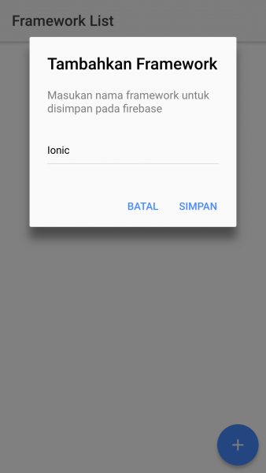

Setelah disimpan maka data tersebut akan tampil langsung pada list yang telah dibuat.

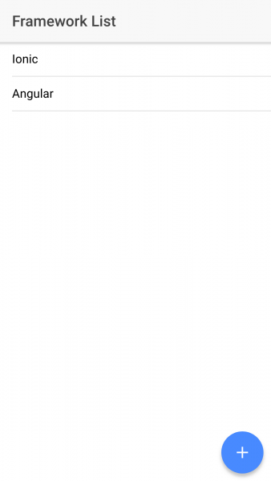

Untuk mengecek data yang telah kita input di Firebase, buka dashboard firebase klik tab data kemudian klik tanda "+" untuk expand data

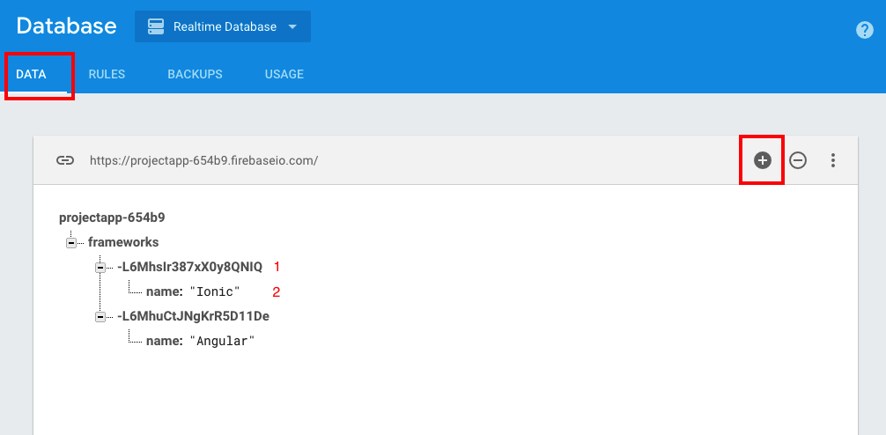

Pada gambar diatas, no. 1 adalah ID dari data, kemudian no. 2 ada nilainya.

Setiap kalian tambahkan data pada aplikasi ionic, maka data diatas akan otomatis ter-update.

#### Membuat fungi edit dan hapus

Alurnya adalah saat list data di klik maka akan tampil option yang akan dilakukan, yaitu hapus atau edit, kita akan menggunakan [ActionSheetController](https://ionicframework.com/docs/components/#action-sheets) ionic untuk melakukan hal tersebut.

Sebelumnya kita harus import module tersebut kedalam file home.ts dan meng-inject kedalam constructor.

```typescript
import { NavController, AlertController, ActionSheetController } from 'ionic-angular';
```

```typescript
constructor(public navCtrl: NavController, private afDatabase: AngularFireDatabase, private alertCtrl: AlertController, private actionSheetCtrl: ActionSheetController) {
    this.frameworksRef = this.afDatabase.list('/frameworks');
    this.frameworks = this.frameworksRef.snapshotChanges().map(changes => {
        return changes.map(c => ({ key: c.payload.key, ...c.payload.val() }));
    });
}
```

Selanjutnya buat fungsi untuk menampilkan action sheet tersebut

```typescript
showOptions(id, name) {
    let actionSheet = this.actionSheetCtrl.create({
        title: 'Opsi',
        buttons: [
            {
                text: 'Edit',
                handler: () => {
                    this.update(id, name);
                }
            },
            {
                text: 'Hapus',
                role: 'destructive',
                handler: () => {
                    this.delete(id);
                }
            },
            {
                text: 'Batal',
                role: 'cancel'
            }
        ]
    });
    actionSheet.present();
}
```

Setelah itu dibawahnya buat fungsi untuk update data.

```typescript
update(id, name) {
    let prompt = this.alertCtrl.create({
        title: 'Edit Framework',
        message: "Masukan nama perbarui data pada firebase",
        inputs: [{
            name: 'name',
            placeholder: 'Nama Framework',
            value: name
        }],
        buttons: [
            { text: 'Batal' },
            {
                text: 'Simpan',
                handler: data => {
                    this.frameworksRef.update(id, { // Code untuk memperbarui data
                        name: data.name, // Code untuk memperbarui data
                    }); // Code untuk memperbarui data
                }
            }
        ]
    });
    prompt.present();
}
```

Lalu tambahkan fungsi untuk delete

```typescript
delete(id) {
    this.frameworksRef.remove(id);
}
```

Setelah semua fungsi dibuat, selanjutnya pada file home.html, kita perlu menambahkan event klik untuk menampilkan option

```html
<ion-header>
    <ion-navbar>
        <ion-title>
            Framework List
        </ion-title>
    </ion-navbar>
</ion-header>

<ion-content>
    <ion-item *ngFor="let framework of frameworks | async" (click)="showOptions(framework.id, framework.name)">{{ framework.name }}</ion-item>  <!--Perubahan -->
    <ion-fab bottom right>
        <button ion-fab (click)="add()"><ion-icon name="add"></ion-icon></button>
    </ion-fab>
</ion-content>
```

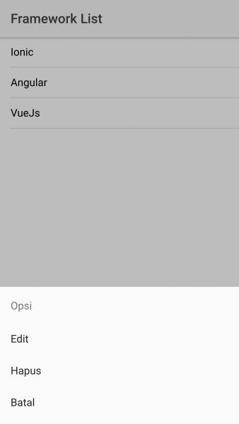

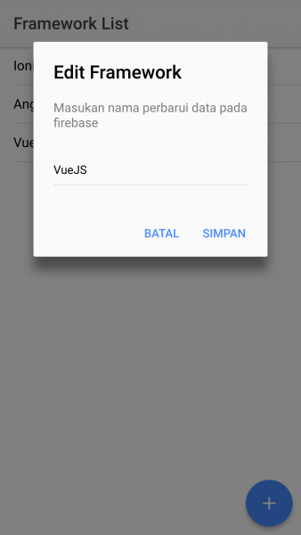

Demikianlah tutorial kali ini. Full source code nya dapat kalian download [disini](https://github.com/andriyandriyan/simple-ionic-firebase). Demo app dapat kalian cek [disini](http://andriyandriyan.com/simple-ionic-firebase/).

Semoga Bermanfaat.