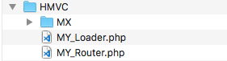
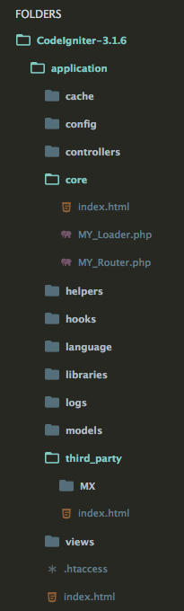
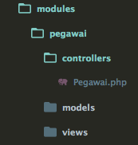

HMVC (Hierarchical Model View Controller) adalah evolusi dari MVC. Dengan HMVC memungkinkan kita memisahkan folder menjadi per modul. Misalkan kita punya modul pegawai maka kita dapat menggabungkan folder Model, View dan Controller menjadi 1 folder.

Kelebihan HMVC adalah apabila kita mengerjan suatu project dengan bersama tim. Saat mengerjakan suatu module, maka tidak akan menggangu module yang lainnya.

#### **Cara setup HMVC di CodeIgniter**

#### Langkah 1.

Download CodeIgniter di website resminya di [https://codeigniter.com](https://codeigniter.com)

#### Langkah 2.

Download file HMVC [disini](https://goo.gl/Zy1WSM). Extract file .zip tersebut. Maka isinya dari foldernya seperti berikut

Copy kan file `MY_Loader.php` dan `MY_Router.php` ke folder `application/core` yang pada pada project CodeIgniter.

Copy kan folder `MX` ke folder `application/third_party` pada projct CodeIgniter.  
Maka struktur dari folder application menjadi seperti ini

#### Langkah 3.

Buat sebuah folder pada folder `application` dan beri nama `modules`

Folder ini lah yang berisi beberapa module dari project kita.

#### Langkah 4.

Selanjutnya kita akan membuat sebuah module pegawai.

Buat sebuah folder baru pada folder `modules` yang telah kita buat dan beri nama `pegawai`

Didalam folder ini kita buat folder Model, View dan Controller. Selanjutnya kita bisa membuat file Model, View dan Controller seperti biasa. Contohnya bisa lihat seperti dibawah ini

*Catatan : Untuk nama controller harus sesuai dengan nama module yang dibuat. Jika tidak maka saat ingin mengakses controller pada folder module kita harus memasukan nama module kita pada url.

Contohnya misal didalam folder controller kita membuat controller dengan nama `Kasir.php` maka untuk url nya menjadi `http://localhost/nama_project/pegawai/kasir/nama_fungsi/`

Sekian. Semoga bermanfaat.