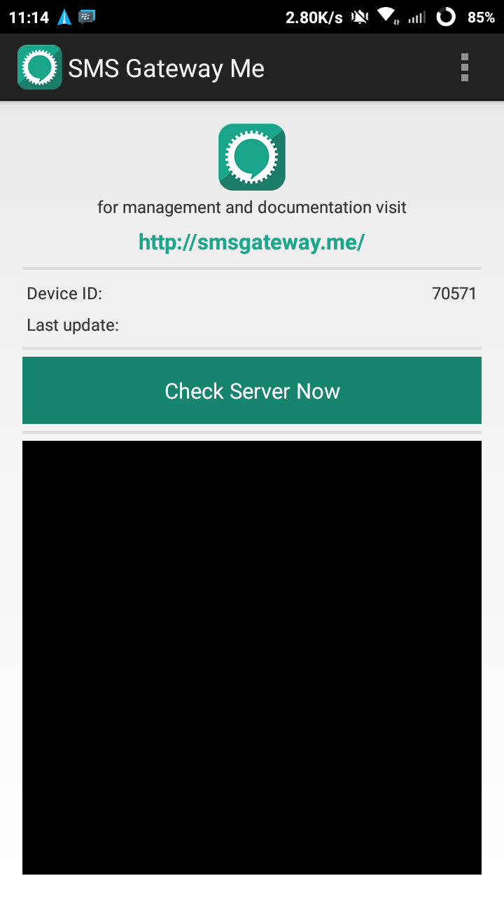
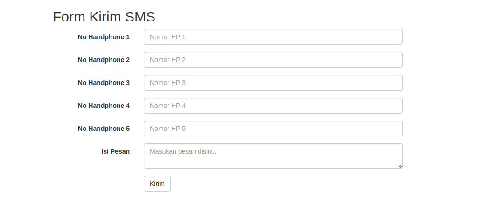
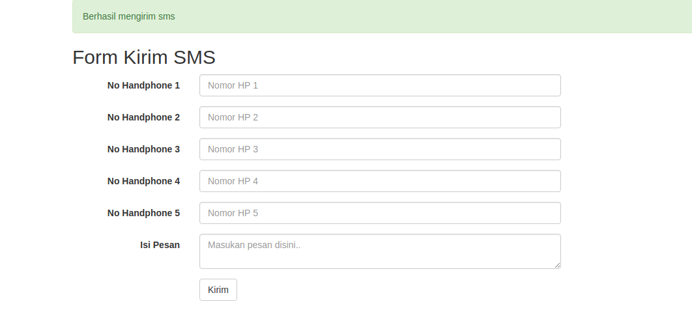

SMS Gateway dengan smsgateway.me dan CodeIgniter sangatlah mudah dan simple. Tanpa perlu instalasi modem dan hanya menggunakan Hanphone kita sendiri.

Saya menggunakan library dari pihak ketiga unutk mengirim SMS Gateway yaitu [smsgateway.me](http://smsgateway.me). Library ini cukup simple dan mudah dalam penerepannya dan yang terpenting adalah ini GRATIS. Library ini sebagai pengganti modem yang biasa dipakai untuk mengirim SMS misal Gammu. Oke langsung saja mulai.

#### DAFTAR SMS GATEWAY

Pertama adalah kita harus membuat akun terlebih dahulu. Kalian bisa mendaftar [disini](https://smsgateway.me/admin/users/login#signup)

Setelah mendaftar selanjutnya kalian perlu menginstall sebuah aplikasinya di playstore. Aplikasi ini berfungsi sebagai pengganti modem. Size aplikasinya sangat kecil, hanya 1,6 MB. Aplikasinya bisa kalian download [disini](https://play.google.com/store/apps/details?id=networked.solutions.sms.gateway.api). Setelah di install lalu login dengan akun yang sudah didaftarkan.

#### Download library sms gateway

Selanjutnya adalah mendownload library yang akan digunakan untuk mengirim SMS. Halaman untuk mendownload ada pada [halaman ini](https://smsgateway.me/sms-api-documentation/getting-started) dibagian paling bawah. Setelah didownload, extract file dan copy kan file `smsGateway.php` ke folder `libraries` pada project CodeIgniter kita.

Buka file tersebut dan ubah email dan password pada bagian construct sesuai dengan akun kita

```php
<?php

    class Smsgateway {

        static $baseUrl = "https://smsgateway.me";

        function __construct() {
            $this->email = 'xxx@mail.com';
            $this->password = 'xxxx';
		}
```

#### membuat controller dan view

Buat sebuah file controller dan beri nama Sms.php

```php
<?php
defined('BASEPATH') OR exit('No direct script access allowed');

class Sms extends CI_Controller {

  public function index() {
    $this->load->view('form_sms');
  }

  public function kirim_sms() {
    $this->load->library('smsgateway');
    $no_hp = $this->input->post('no_hp');

    $numbers = array();
    foreach ($no_hp as $key => $value) {
      if ($value != '') {
        array_push($numbers, $value);
      }
    }

    $deviceID = 70571;
    $message = $this->input->post('isi_pesan');

    $result = $this->smsgateway->sendMessageToManyNumbers($numbers, $message, $deviceID);
    if (count($result['response']['result']['success']) > 0) {
      $this->session->set_flashdata('message', '<div class="alert alert-success">Berhasil mengirim sms</div>');
    } else {
      $this->session->set_flashdata('message', '<div class="alert alert-danger">Gagal mengirim sms</div>');
    }

    redirect('sms','refresh');
  }

}

/* End of file Sms.php */
/* Location: ./application/controllers/Sms.php */
```

Variable deviceID adalah id yang ada pada aplikasi yang kita install



#### Membuat file view

Buat sebuah file view dan beri nama form_sms.php

```html
<!DOCTYPE html>
<html lang="en">
<head>
  <title>SMS Gateway Dengan CodeIgniter</title>
  <meta charset="utf-8">
  <meta name="viewport" content="width=device-width, initial-scale=1">
  <link rel="stylesheet" href="https://maxcdn.bootstrapcdn.com/bootstrap/3.3.7/css/bootstrap.min.css">
  <script src="https://ajax.googleapis.com/ajax/libs/jquery/3.2.1/jquery.min.js"></script>
  <script src="https://maxcdn.bootstrapcdn.com/bootstrap/3.3.7/js/bootstrap.min.js"></script>
</head>
<body>

  <div class="container">
    <?php echo $this->session->flashdata('message'); ?>
    <h2>Form Kirim SMS</h2>
    <form class="form-horizontal" action="<?php echo site_url('sms/kirim_sms') ?>" method="POST">
      <div class="form-group">
        <label class="control-label col-sm-2">No Handphone 1</label>
        <div class="col-sm-6">
          <input type="text" class="form-control" placeholder="Nomor HP 1" name="no_hp[]">
        </div>
      </div>
      <div class="form-group">
        <label class="control-label col-sm-2">No Handphone 2</label>
        <div class="col-sm-6">
          <input type="text" class="form-control" placeholder="Nomor HP 2" name="no_hp[]">
        </div>
      </div>
      <div class="form-group">
        <label class="control-label col-sm-2">No Handphone 3</label>
        <div class="col-sm-6">
          <input type="text" class="form-control" placeholder="Nomor HP 3" name="no_hp[]">
        </div>
      </div>
      <div class="form-group">
        <label class="control-label col-sm-2">No Handphone 4</label>
        <div class="col-sm-6">
          <input type="text" class="form-control" placeholder="Nomor HP 4" name="no_hp[]">
        </div>
      </div>
      <div class="form-group">
        <label class="control-label col-sm-2">No Handphone 5</label>
        <div class="col-sm-6">
          <input type="text" class="form-control" placeholder="Nomor HP 5" name="no_hp[]">
        </div>
      </div>
      <div class="form-group">
        <label class="control-label col-sm-2">Isi Pesan</label>
        <div class="col-sm-6">
          <textarea name="isi_pesan" class="form-control" placeholder="Masukan pesan disini.."></textarea>
        </div>
      </div>
      <div class="form-group">        
        <div class="col-sm-offset-2 col-sm-10">
          <button type="submit" class="btn btn-default">Kirim</button>
        </div>
      </div>
    </form>
  </div>

</body>
</html>
```

#### Testing

Sekarang buka halaman `http://localhost/nama_project/index.php/sms` Jika tidak ada error maka tampil seperti berikut ini.



Jika SMS berhasil dikirim maka hasilnya adalah



Notes :

*   Untuk mengirim SMS Handphone yang digunakan harus membuka aplikasi sms gateway dan pulsa mencukupi
*   Komputer atau laptop harus terhubung ke internet karena mengakses api dari smsgateway.me

Sekian dan semoga bermanfaat.