Ketika membuat sebuah aplikasi, terkadang kita harus menyimpan berbagai file user seperti gambar, video dan lainnya. Biasanya kita akan menyimpan file tersebut pada server bersama dengan aplikasi yang kita buat. Pada dasarnya ini bukan sebuah masalah, tapi semakin lama aplikasi berjalan penyimpanan pada server pun semakin besar. Jika menggunakan shared hosting, otomatis kita harus upgrade paket hosting untuk menaikkan kapasitas penyimpanan pada hosting tersebut.

Saat ini menyimpan file tidak harus disimpan bersama aplikasi kita. Banyak layanan cloud storage yang tinggal pakai dan gratis(dengan batasan tertentu) seperti [**AWS S3**](https://aws.amazon.com/s3/), [**Google Cloud Store**](https://cloud.google.com/storage/) dan [**Firebase Storage**](https://firebase.google.com/docs/storage).

### Firebase Storage

Firebase Storage merupakan layanan cloud storage dari Firebase. Firebase Storage memberikan penyimpan gratis sebesar 5GB pada paket SPARK. Jika telah melebihi 5GB Anda dapat upgrade ke paket Blaze. Untuk detail informasi harga dapat dilihat [disini](https://firebase.google.com/pricing).

### Firebase Storage dengan Lumen

Pada dokumentasi Laravel, Laravel tidak menyediakan provider untuk meng-integrasikan Firebase Storage dengan Laravel/Lumen. Kita perlu menggunakan library tambahan yaitu `laravel-google-cloud-storage`.

# Langkah-langkah

### Buat Proyek Baru

Buat sebuah proyek lumen baru dengan mengetikan perintah berikut pada terminal kalian

```bash
$ composer create-project --prefer-dist laravel/lumen lumen-firebase-storage
```

### Membuat Proyek Firebase

Kunjukin link Firebase Console [disini](https://console.firebase.google.com/) kemudian buat sebuah proyek baru dan beri nama proyek tersebut sesuai keinginan kalian.

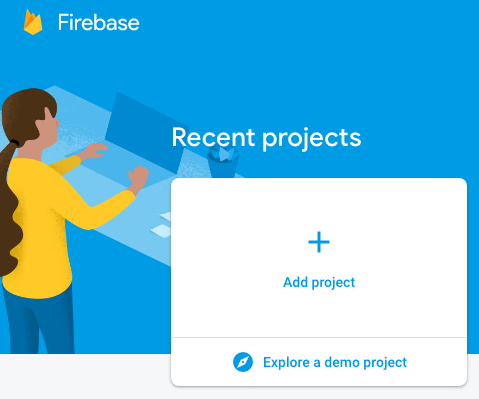

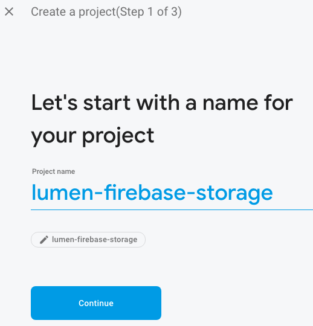

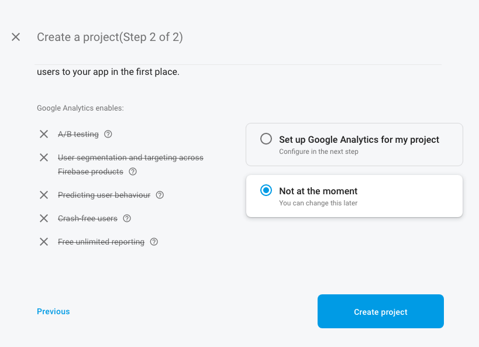

Setelah klik create project, tunggu beberapa saat hingga diarahkan ke halaman dashboard.

Pada halaman dashboard, klik menu Storage di bagian kiri kemudian klik tombol **Get Started**.
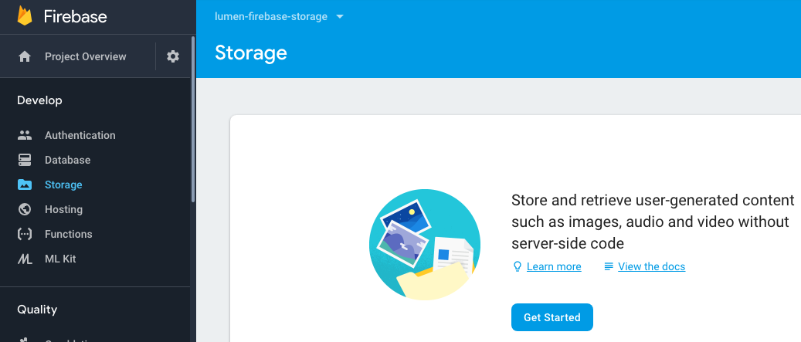

Pada bagian secure rule langsung next saja.
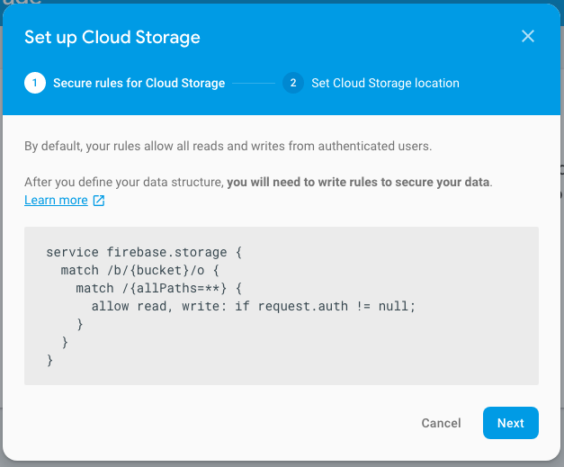

Pilih default cloud location dan klik **Done**.
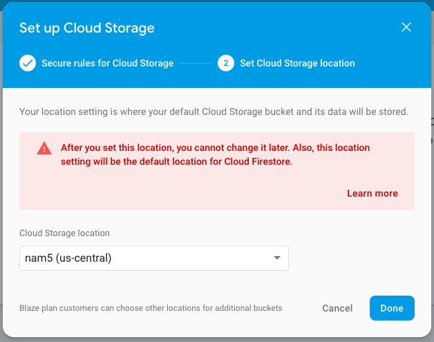

### Install Dependency

Ada 2 dependency yang kita butuhkan yaitu `league/flysystem` dan
`superbalist/laravel-google-cloud-storage`

```bash
$ composer require league/flysystem superbalist/laravel-google-cloud-storage
```

Kemudian daftarkan service provider di `bootstrap/app.php`

```php
$app->register(Superbalist\LaravelGoogleCloudStorage\GoogleCloudStorageServiceProvider::class);
```

Selanjutnya membuat file konfigurasi untuk Firebase Storage di `config/filesystems.php`. Isi filenya ada sebagai berikut

```php
<?php
return [
    /*
    |--------------------------------------------------------------------------
    | Default Filesystem Disk
    |--------------------------------------------------------------------------
    |
    | Here you may specify the default filesystem disk that should be used
    | by the framework. The "local" disk, as well as a variety of cloud
    | based disks are available to your application. Just store away!
    |
    */
    'default' => env('FILESYSTEM_DRIVER', 'local'),
    /*
    |--------------------------------------------------------------------------
    | Default Cloud Filesystem Disk
    |--------------------------------------------------------------------------
    |
    | Many applications store files both locally and in the cloud. For this
    | reason, you may specify a default "cloud" driver here. This driver
    | will be bound as the Cloud disk implementation in the container.
    |
    */
    'cloud' => env('FILESYSTEM_CLOUD', 's3'),
    /*
    |--------------------------------------------------------------------------
    | Filesystem Disks
    |--------------------------------------------------------------------------
    |
    | Here you may configure as many filesystem "disks" as you wish, and you
    | may even configure multiple disks of the same driver. Defaults have
    | been setup for each driver as an example of the required options.
    |
    | Supported Drivers: "local", "ftp", "sftp", "s3", "rackspace"
    |
    */
    'disks' => [
        'local' => [
            'driver' => 'local',
            'root' => storage_path('app'),
        ],
        'public' => [
            'driver' => 'local',
            'root' => storage_path('app/public'),
            'url' => env('APP_URL').'/storage',
            'visibility' => 'public',
        ],
        'gcs' => [
            'driver' => 'gcs',
            'project_id' => env('GOOGLE_CLOUD_PROJECT_ID', 'your-project-id'),
            'key_file' => env('GOOGLE_CLOUD_KEY_FILE', null),
            'bucket' => env('GOOGLE_CLOUD_STORAGE_BUCKET', 'your-bucket'),
            'path_prefix' => env('GOOGLE_CLOUD_STORAGE_PATH_PREFIX', null),
            'storage_api_uri' => env('GOOGLE_CLOUD_STORAGE_API_URI', null),
            'visibility' => 'public',
        ],
    ],
];
```

Buat variabel baru pada file `.env`

```
GOOGLE_CLOUD_PROJECT_ID=
GOOGLE_CLOUD_KEY_FILE=
GOOGLE_CLOUD_STORAGE_BUCKET=
```

### Autentikasi Firebase Storage
Secara default Firebase Storage hanya mengizinkan untuk upload file jika user telah di autentikasi. Maka kita perlu key agar aplikasi kita dapat upload file Firebase Storage. Kunjungi link [berikut](https://console.cloud.google.com/iam-admin/serviceaccounts), Anda akan diarahkan ke bagian service account dari google cloud, pilih proyek yang telah kita buat di Firebase, lalu pada tabel service accounts pada kolom **Actions** klik dan pilih **Create Key**.

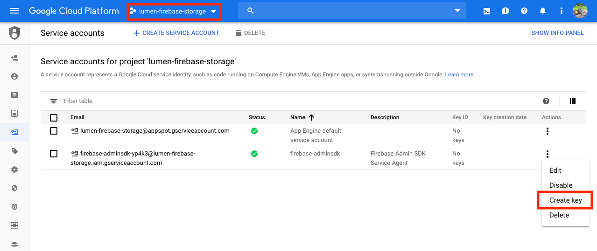

Untuk key type pilih JSON dan klik tombol **Create**.

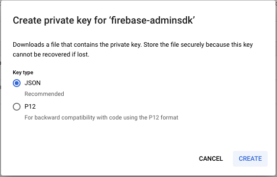

Setelahnya akan mendownload file dengan ekstensi json. Copy file tersebut ke folder public proyek lumen yang telah dibuat.
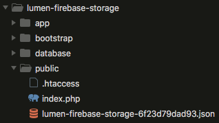

Lalu update file `.env` update variabel `GOOGLE_CLOUD_PROJECT_ID` isi dengan nama proyek Firebase dan variabel `GOOGLE_CLOUD_KEY_FILE` dengan nama file key yang ada di folder public. Untuk variabel `GOOGLE_CLOUD_STORAGE_BUCKET` dapat dilihat pada menu **Storage** pada console firebase.

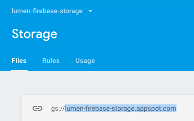

Sehingga hasilnya seperti berikut
```
GOOGLE_CLOUD_PROJECT_ID=lumen-firebase-storage
GOOGLE_CLOUD_KEY_FILE=lumen-firebase-storage-6f23d79dad93.json
GOOGLE_CLOUD_STORAGE_BUCKET=lumen-firebase-storage.appspot.com
```

### Menulis Kode
Sekarang waktunya menulis kode, karena kodenya sangat simple maka saya akan menulis kodenya langsung di routingnya.
```php
<?php

use Illuminate\Http\Request;
use Illuminate\Support\Facades\Storage;

/*
|--------------------------------------------------------------------------
| Application Routes
|--------------------------------------------------------------------------
|
| Here is where you can register all of the routes for an application.
| It is a breeze. Simply tell Lumen the URIs it should respond to
| and give it the Closure to call when that URI is requested.
|
*/

$router->get('/', function () use ($router) {
    return $router->app->version();
});

// Upload gambar ke Firebase Storage
$router->post('/images', function (Request $request) use ($router) {
    $this->validate($request, [
        'image' => 'required|image',
    ]);
    $file = $request->file('image');
    $name = time() . '-' . $file->getClientOriginalName();
    $filePath = 'images/' . $name;
    Storage::disk('gcs')->put($filePath, file_get_contents($file));
    return response()->json([
        'message' => 'Gambar berhasil diupload'
    ]);
});

// Menampilkan semua gambar
$router->get('/images', function () use ($router) {
    $images = [];
    $files = Storage::disk('gcs')->files('images');
    foreach ($files as $file) {
        $images[] = [
            'name' => str_replace('images/', '', $file),
            'src'  => Storage::disk('gcs')->url($file),
        ];
    }
    return response()->json($images);
});

// Menghapus gambar
$router->post('/delete-images', function (Request $request) use ($router) {
    $this->validate($request, [
        'image' => 'required',
    ]);
    $image = $request->input('image');
    Storage::disk('gcs')->delete('images/' . $image);
    return response()->json([
        'message' => 'Gambar berhasil dihapus '
    ]);
});
```

### Uji Coba
Sekarang waktu untuk uji coba aplikasi yang telah dibuat, saya menggunakan postman untuk uji cobanya. Sebelumnya jalankan aplikasi kita terselbih dahulu.
```
$ php -S localhost:3000 -t public
```

#### Upload
Pilih file yang akan di upload seperti berikut:


#### Menampilkan Semua Gambar
Kita hanya memasukan url dari route yang telah dibuat:

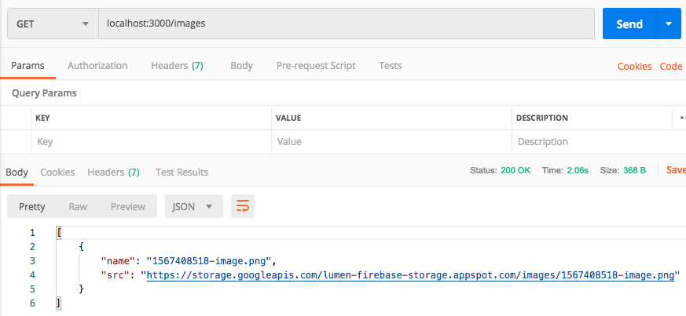

Pada Firebase Storage kita dapat melihat file yang telah diupload.

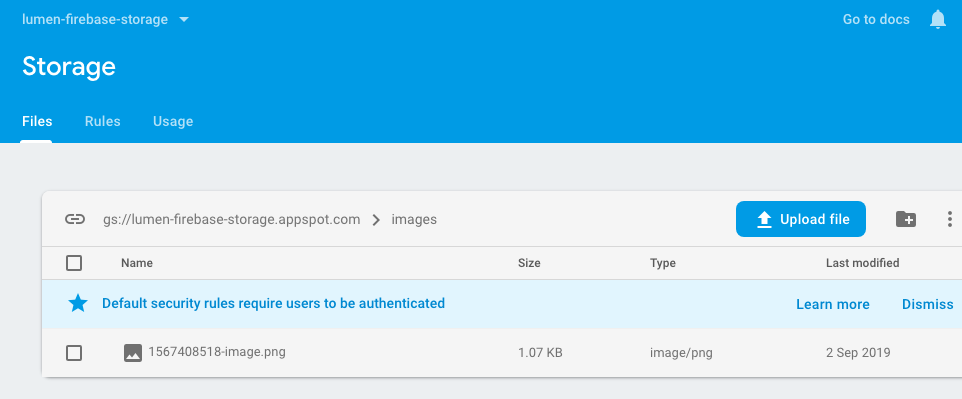

#### Menghapus Gambar
Copy nama file yang ingin dihapus dan masukan ke form data

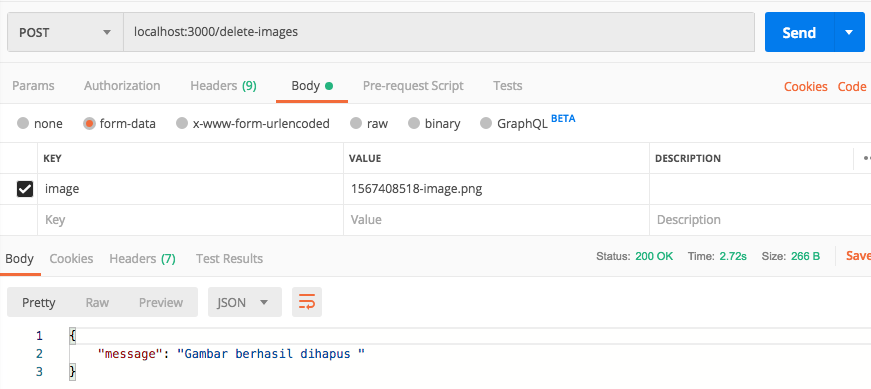

Demikian pembahasan singkat untuk artikel kali ini. Hasil pembelajaran kali ini dapat dilihat pada link github saya [https://github.com/andriyandriyan/lumen-firebase-storage](https://github.com/andriyandriyan/lumen-firebase-storage). Semoga bermanfaat.